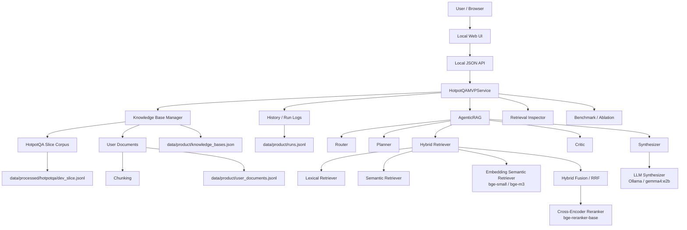
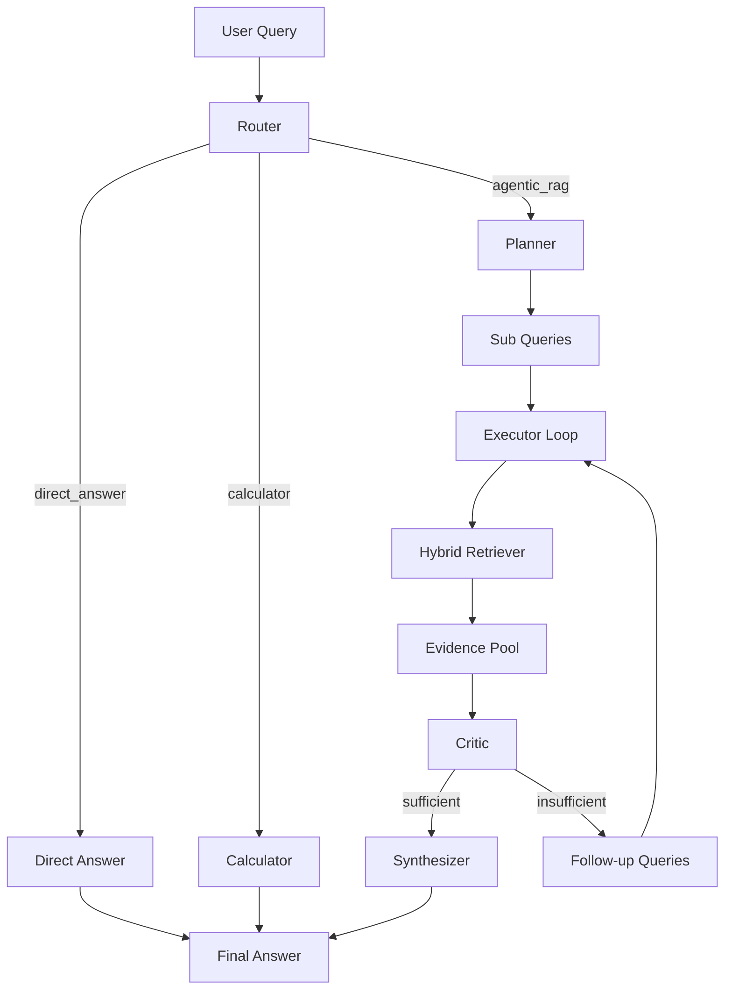
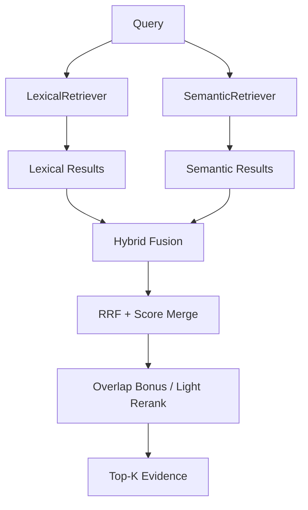
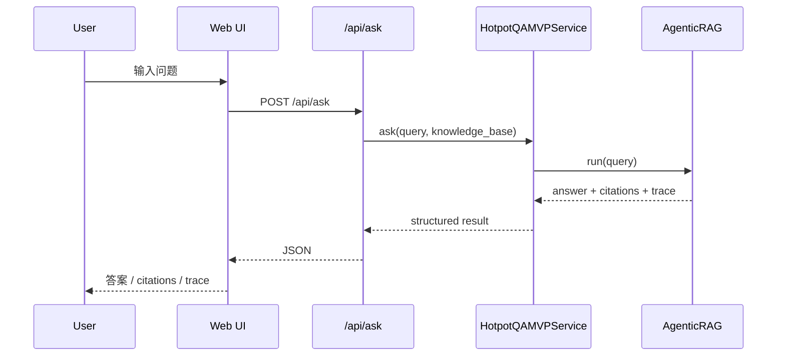
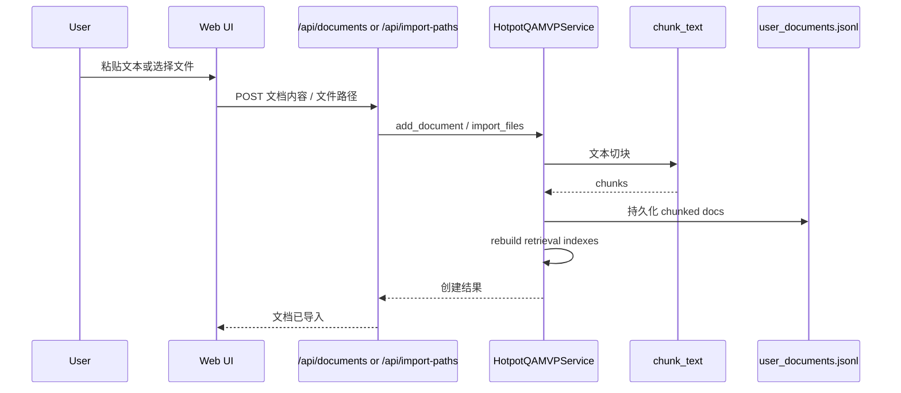
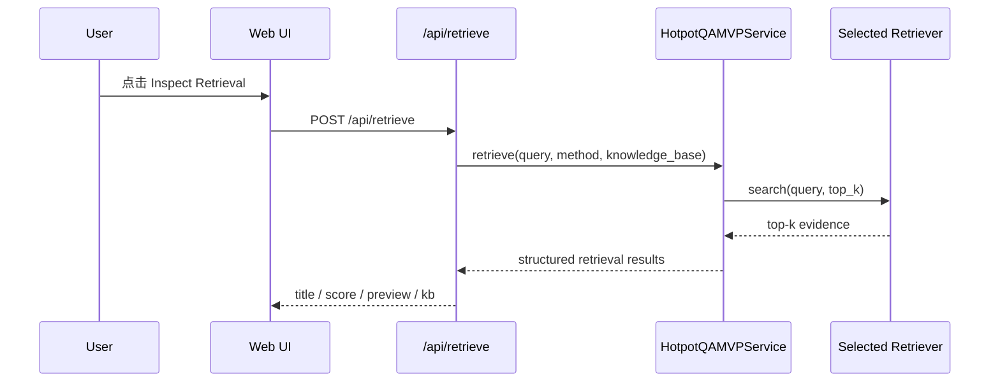
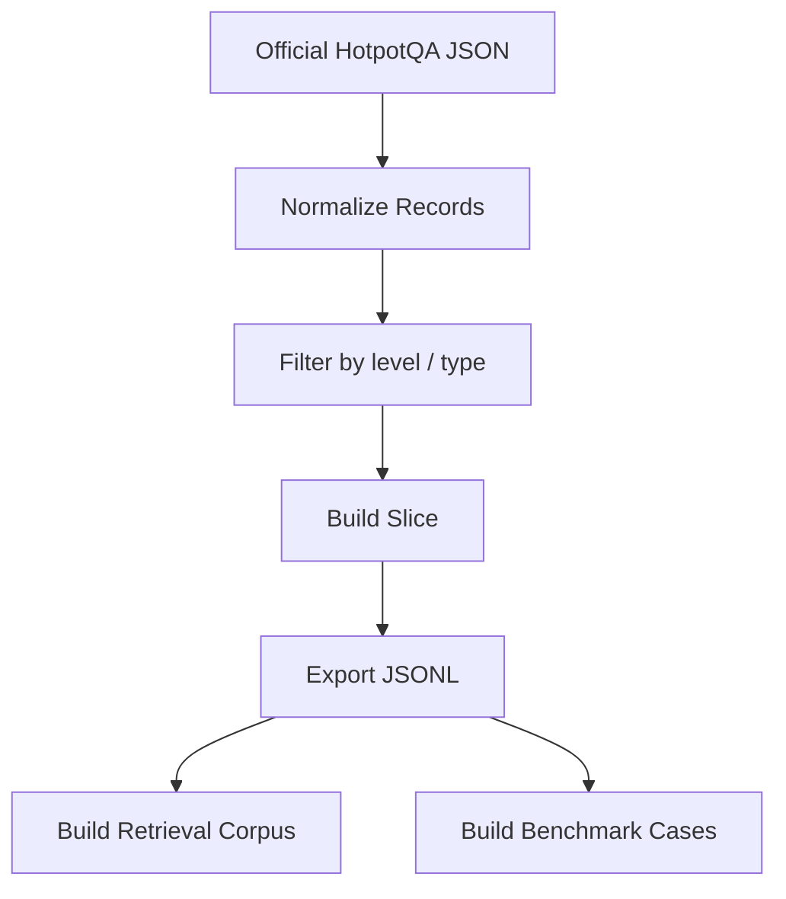

# AgenticRAG-Lab 架构图与工作流

这份文档用于沉淀当前项目的核心架构、数据流、产品工作流和关键存储面，方便后续：

- 面试讲解
- 项目协作
- 后续重构
- 从原型升级到真实生产能力

---

## 1. 项目总体定位

`AgenticRAG-Lab` 当前是一个面向复杂多跳问答场景的 `Agentic RAG` 本地产品原型。

它同时包含两层能力：

- **算法 / 系统层**：`Router + Planner + Retriever + Critic + Synthesizer`
- **产品层**：`Web UI + JSON API + 多知识库 + 文档导入 + 检索调试 + 历史记录 + 本地运行日志`

---

## 2. 总体架构图



---

## 3. Agentic RAG 主链路

### 3.1 主执行链



### 3.2 关键职责

#### Router

负责问题分流：

- 简单定义问题 → `direct_answer`
- 算术表达式 → `calculator`
- 复杂自然语言问题 → `agentic_rag`

#### Planner

负责把复杂问题拆成更容易执行的子问题：

- bridge entity 类问题先拆桥接事实
- comparison 类问题为后续检索提供结构化入口

#### Retriever

当前由三层组成：

- `LexicalRetriever`
- `SemanticRetriever`
- `HybridRetriever`

其中 `HybridRetriever` 对前两者结果做融合与轻量 rerank。

#### Critic

负责判断当前证据是否足够支撑回答：

- 足够 → 进入答案合成
- 不足 → 生成 follow-up query，继续检索

#### Synthesizer

负责根据问题类型与证据内容输出最终答案：

- 教育类问题优先抽取 `studied at ...`
- comparison / same-nationality 优先输出 `yes/no`
- 通用问题退化为基于相关句子的 extractive synthesis

---

## 4. 检索层架构图



### 4.1 当前实现逻辑

#### LexicalRetriever

- 基于 token overlap 和类 BM25 的 `idf` 加权
- 更适合精确标题和关键词匹配

#### SemanticRetriever

- 基于 token expansion 和 cosine-like 相似度
- 更适合语义相关但词面不完全一致的问题

#### HybridRetriever

- 分别拿 lexical / semantic 的候选
- 用 `Reciprocal Rank Fusion` 融合
- 再叠加轻量 overlap bonus 做伪 rerank

---

## 5. 产品层工作流

### 5.1 用户问答工作流



### 5.2 文档导入工作流



### 5.3 检索调试工作流



---

## 6. 数据与评测工作流

### 6.1 HotpotQA 数据接入



### 6.2 Retrieval Baseline / Ablation

```mermaid
flowchart TD
    SLICE[HotpotQA Slice] --> CORPUS[Corpus Builder]
    SLICE --> CASES[Case Builder]

    CORPUS --> LEX[Lexical Retriever]
    CORPUS --> SEM[Semantic Retriever]
    CORPUS --> HYB[Hybrid Retriever]

    CASES --> EVAL[Evaluation Loop]
    LEX --> EVAL
    SEM --> EVAL
    HYB --> EVAL

    EVAL --> M1[supporting_doc_recall@k]
    EVAL --> M2[all_supporting_docs_hit_rate@k]
    EVAL --> M3[any_supporting_doc_hit_rate@k]
```

---

## 7. 存储面说明

当前项目主要有四类本地存储：

### 7.1 Benchmark 数据

- `data/raw/hotpotqa/`
- `data/processed/hotpotqa/dev_slice.jsonl`

作用：

- 存官方 HotpotQA 原始数据
- 存可直接被评测与产品层复用的小切片

### 7.2 用户文档

- `data/product/user_documents.jsonl`

作用：

- 存用户新增或导入的知识库文档
- 当前按 chunk 粒度存储

### 7.3 知识库注册表

- `data/product/knowledge_bases.json`

作用：

- 存知识库名称、描述、来源

### 7.4 运行日志

- `data/product/runs.jsonl`

作用：

- 记录 ask / retrieve / add_document / import_files 等动作
- 为未来接入 Langfuse 或更强可观测性预留事件层

---

## 8. 当前 API 工作流汇总

### 8.1 已有 API

- `GET /api/health`
- `GET /api/stats`
- `GET /api/examples`
- `GET /api/benchmark`
- `GET /api/documents`
- `GET /api/history`
- `GET /api/runs`
- `GET /api/knowledge-bases`
- `POST /api/ask`
- `POST /api/documents`
- `POST /api/retrieve`
- `POST /api/import-paths`
- `POST /api/knowledge-bases`

### 8.2 API 分层意义

- `/api/ask`：最终问答能力
- `/api/retrieve`：检索调试能力
- `/api/documents`：内容管理能力
- `/api/knowledge-bases`：知识域管理能力
- `/api/history` / `/api/runs`：可观测性与可回放能力

这让系统不再只是“一个问答接口”，而是一个最小可用的本地 RAG 工作台。

---

## 9. 当前架构优势

### 9.1 模块边界清晰

Agent 主链路、检索层、评测层、产品层、Web 层分层明确，后续替换成本低。

### 9.2 既能做 benchmark，也能做产品演示

项目既有 HotpotQA benchmark 面，又有本地 UI / API 产品面，适合校招面试和后续继续打磨。

### 9.3 低依赖、易复现

核心路径零运行时依赖;真实模型(`sentence-transformers`, `bge-*`, Ollama)作为**可选扩展**通过 `requirements-real.txt` 和 `--real` 开关启用。离线开发与快速迭代与真实模型验证可共存。

### 9.4 为后续升级预留了接口,已完成主要替换

**已完成的真实化替换**:

- ✅ dense embedding:`EmbeddingSemanticRetriever` (bge-small-en-v1.5)
- ✅ cross-encoder reranker:`CrossEncoderReranker` (bge-reranker-base)
- ✅ LLM synthesizer:`LLMSynthesizer` 走 Ollama / gemma4:e2b
- ✅ 三组件独立降级:任一失败自动退回规则版

**尚未替换**(但接口就位):

- 真实 BM25(当前为 BM25-like token 频次)
- LLM Planner / LLM Critic
- Langfuse / trace backend

---

## 10. 当前架构短板

### 10.1 检索内核 dense/rerank 已真实化,但 BM25 与 embedding 规格偏轻

当前 `SemanticRetriever` 规则版保留作 baseline;真实路径用了 `bge-small-en-v1.5` + `bge-reranker-base`。后续可换更大的 `bge-m3` / `bge-reranker-v2-m3` 或真实 `rank_bm25`。

### 10.2 Planner / Critic 还不是通用智能体能力

它们当前更像稳定可测的规则实现，而不是完整 LLM agent。

### 10.3 本地持久化方案简单

JSONL / JSON 足够支撑原型，但不适合真正的并发、多用户和复杂查询场景。

### 10.4 可观测性仍偏轻量

虽然已经有本地运行日志，但还没接 trace 平台和更细粒度统计。

---

## 11. 下一步建议工作流

### 11.1 [已完成] 补真实检索

```text
Proxy Retrieval (rule semantic + token rerank)
   ↓  done
bge-small-en-v1.5 + bge-reranker-base
   ↓
HotpotQA 500 样本 all_hit@5: 0.302 → 0.930
```

完整结果见 `doc/BENCHMARK_RESULTS.md`。

### 11.2 [进行中] 接入真实 LLM Synthesizer

```text
Rule-based Synthesizer
   ↓
LLMSynthesizer + Ollama (gemma4:e2b / qwen2.5:7b)   ← 已接入
   ↓
端到端 EM / F1 / citation rate benchmark            ← 待跑
```

### 11.3 补更强的 Planner / Critic

```text
Rule-based Planner/Critic
   ↓
LLM Planner / LLM Critic
   ↓
Better Multi-hop Stability
```

### 11.4 升级 embedding / reranker 规格

```text
bge-small-en-v1.5 (133MB) → bge-m3 (2.3GB, 多语言)
bge-reranker-base (280MB) → bge-reranker-v2-m3 (2GB)
```

### 11.5 再补更强观测

```text
Local runs.jsonl
   ↓
Structured Trace Events
   ↓
Langfuse / Observability Backend
```

### 11.6 扩数据集

```text
HotpotQA only (500 samples)
   ↓
+ MuSiQue (2-hop / 3-hop / 4-hop 分层)
   ↓
跨数据集 + 跨跳数验证
```

---

## 12. 一句话总结

当前 `AgenticRAG-Lab` 的架构可以概括为:

> 一个由 `Agentic RAG` 主链路驱动、以 `HotpotQA 500 样本 + bge + reranker` 为真实 retrieval 评测底座、以 `Ollama LLM synthesizer` 为生成底座、以本地多知识库 MVP 为产品表面的可演进系统原型。

如果从面试角度讲,这套架构已经支撑**「系统设计 + 真实模型消融 + 产品化」三条线同时展开**,并且有具体数字可讲(`all_hit@5: 0.302 → 0.930`)。

